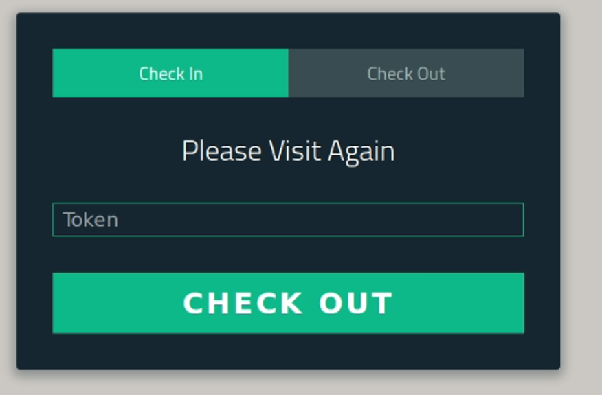

# VMS

The doc can be found [here](https://summergeeks.in/static/assignments/summergeeks%202020%20-%20SDE%20Assignment.pdf). I added an extra feature regarding the checkout option by making use of unique tokens. When a guest checks in, they are given a unique token too. So that while checking out, they can enter it into the system. An admin page has also been added for monitoring. In this project, **Sendgrid** and **Textlocal** for the task of sending email and sending SMS to the parties involved. Also added the count of guests at any moment in the building.

## Machine Configuration

* Operating System - Ubuntu 18.04 (LTS)
* Python version - 3.6.8

### Tech Stack

The System uses a number of open source projects to work properly:

* Django - BackEnd
* React - FrontEnd
* Database - MongoDB

### Installation

Install MongoDB

```sh
$ wget -qO - https://www.mongodb.org/static/pgp/server-4.2.asc | sudo apt-key add -
$ sudo apt-get install gnupg
$ wget -qO - https://www.mongodb.org/static/pgp/server-4.2.asc | sudo apt-key add -
$ echo "deb [ arch=amd64 ] https://repo.mongodb.org/apt/ubuntu bionic/mongodb-org/4.2 multiverse" | sudo tee /etc/apt/sources.list.d/mongodb-org-4.2.list
$ sudo apt-get update
$ sudo apt-get install -y mongodb-org
$ sudo apt-get update
```

### Running

* Run MongoDB
```sh
$ sudo service mongod start
```

* Create the Virtual Environment
```sh
$ python3 -m venv env
$ source env/bin/activate
```

* And in the virtual environment Run Backend
```sh
$ pip3 install -r requirments.txt
$ python3 manage.py makemigrations
$ python3 manage.py migrate
$ python3 manage.py runserver
```

* Run test
```sh
$ python3 manage.py test
```

* Run Frontend
```sh
$ npm install
$ npm start
```

* URLs
```
Host - localhost:3000/host
Checkin/Checkout - localhost:3000
Admin - 127.0.0.1:8000/admin
```

## Screenshots

* Host


* Check-in


* Check-out


* Admin (Guest not checked out)


* Admin (Guest checked out)

